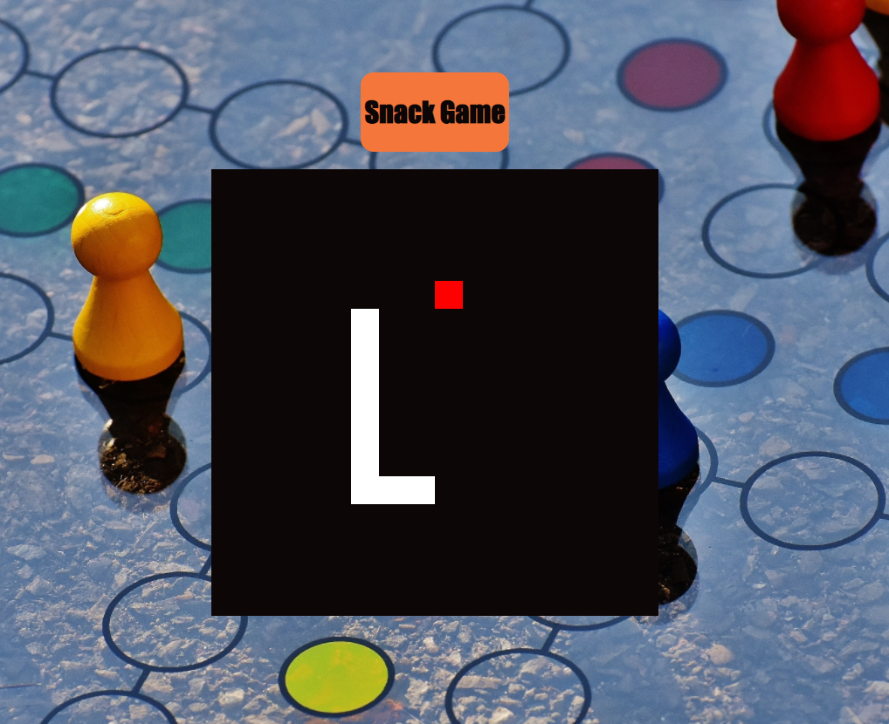

# Snack-Game

Para iniciar o jogo, basta clicar em uma das setas de direção do teclado (< , > , ^)  .
A cobrinha se inicia com o ponto branco e deve comer a fruta, representada pelo ponto vermelho.
O jogo aponta game over quando a cobrinha toca em si mesma.

